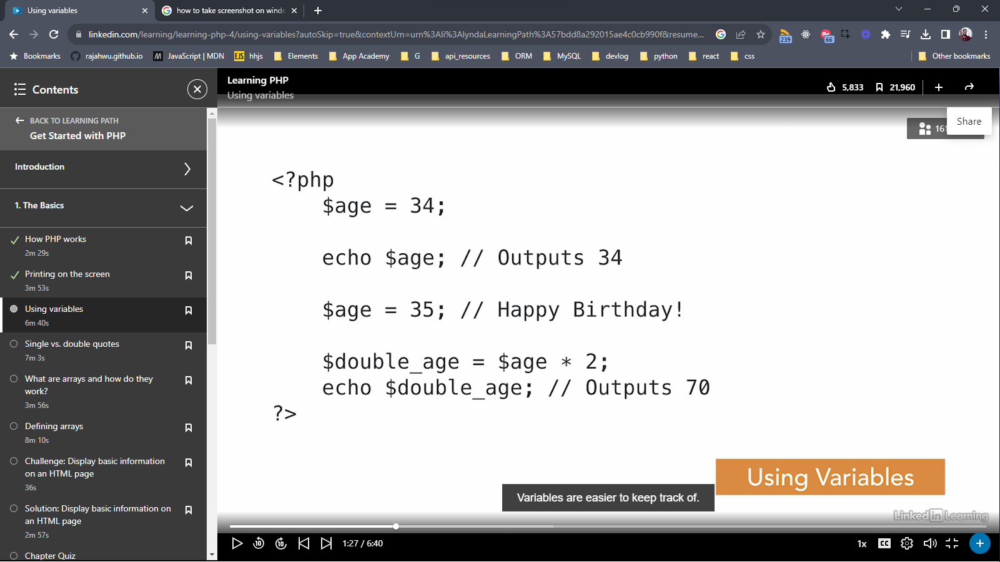

# Variables

A way to store information in order to reference it later



[watch the video](https://www.linkedin.com/learning/learning-php-4/using-variables?autoSkip=true&contextUrn=urn%3Ali%3AlyndaLearningPath%3A57bdd8a292015ae4c0cb990f&resume=false)


```php
    <?php
        $age = 34;

        define('VERSION', 1.1);
    ?>
```

[php Manual: predefined variables](https://www.php.net/manual/en/reserved.variables.php)

## Types

php is a weak typed langauge

* Integers
* Floats
* Characters
* Strings
* Booleans
* Arrays

```php
<?php 
    $name = "Joe";
    $first_letter - 'J';
?>
```
